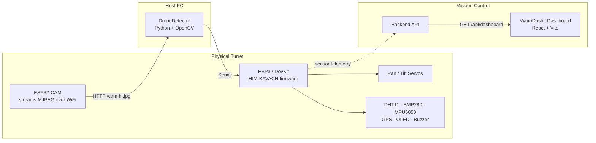

# VyomDrishti · HIM-KAVACH — High-Altitude Anti-Drone System

An environment-aware, AI-monitored anti-drone turret system built for reliable operation in harsh, high-altitude conditions. The system detects and tracks a target in real time via an ESP32 camera feed, drives a pan-tilt turret to keep it centered, continuously monitors onboard environmental/health sensors, and surfaces everything on a live mission-control dashboard.

Built for **Smart India Hackathon**.

---

## System Architecture



**Flow:** the ESP32-CAM streams frames → the Python `DroneDetector` script detects the target and computes pixel error → the error is sent over serial to the ESP32 DevKit → the DevKit runs a PD control loop to steer the pan/tilt servos and center the target, while continuously reading its environmental sensors and driving an OLED HUD → sensor and tracking data feed a backend API that the React dashboard polls for the mission-control UI.

---

## Repository Structure

```
SIH-MAIN-FINAL/
├── Arduino code/
│   ├── esp32.cpp          # HIM-KAVACH — DevKit firmware (PD tracking, sensors, OLED, failsafe)
│   └── esp32Cam.cpp        # ESP32-CAM firmware (MJPEG HTTP server)
├── DroneDetector/
│   └── Code.py              # Python/OpenCV target detector + serial bridge to the DevKit
└── vyomdrishti-dashboard/
    ├── src/                 # React (Vite) mission-control dashboard
    ├── mock_server.py       # stdlib mock backend for local dev without real hardware
    └── README.md            # dashboard-specific setup + full API contract
```

---

## Components

### 1. ESP32-CAM firmware (`Arduino code/esp32Cam.cpp`)
Runs on an AI-Thinker ESP32-CAM. Initializes the camera at QQVGA (160×120), connects to WiFi, and serves the latest frame as JPEG at `http://<esp32-cam-ip>/cam-hi.jpg`. Includes a free-heap safety check that auto-reboots the module if memory runs critically low, to prevent silent stream failures during long deployments.

### 2. DroneDetector (`DroneDetector/Code.py`)
A Python/OpenCV script that:
- Pulls JPEG frames from the ESP32-CAM over HTTP
- Detects the target using HSV color-space thresholding (tuned for red), with contour filtering on area, aspect ratio, circularity, and solidity to reject noise
- Computes the pixel offset between the target and frame center
- Streams that offset over serial (`<errorX,errorY>`) to the ESP32 DevKit at up to 115200 baud
- Renders a live annotated preview window (bounding box, crosshair, mask preview, FPS counter) for debugging/monitoring

### 3. HIM-KAVACH DevKit firmware (`Arduino code/esp32.cpp`)
The core control firmware, running on a separate ESP32 DevKit. Responsibilities:
- **Pan/Tilt tracking:** consumes the serial error stream from `DroneDetector` and runs a smoothed PD (proportional-derivative) control loop, with a dead zone and minimum-step filtering to avoid servo jitter, to keep the target centered
- **Failsafe:** if no target update arrives for 5 seconds, the turret smoothly re-centers itself
- **Environmental sensing:** reads temperature/humidity (DHT11), altitude/pressure (BMP280), and vibration via gyroscope magnitude (MPU6050), plus GPS lock status
- **Adaptive behavior:** automatically increases tracking gain (`Kp`) in low-temperature conditions, and raises audible alerts via buzzer for high vibration ("shaking") or freezing conditions, including a combined "BLIZZARD" state
- **OLED HUD:** a live on-device status display (SH1106G) showing system mode, temperature, altitude/vibration, GPS status, and current control gains
- Gracefully falls back to simulated sensor values if a sensor fails to initialize, so the system stays operational rather than crashing

### 4. VyomDrishti Dashboard (`vyomdrishti-dashboard/`)
A React (Vite) mission-control web app that polls a backend every 2 seconds and renders:
- Environment panel (temperature, wind, pressure, altitude, humidity)
- System health score and operating mode (Normal / Degraded / Critical)
- Live tracking status (detection confidence, reliability, FPS, latency)
- Predictive health trend (current, +10m, +30m, +1h projections)
- Live camera feed with detection overlay
- Per-sensor health breakdown
- SHAP-based explainability panel for what's driving predictions
- Historical graphs across configurable time ranges
- Alerts feed and a manual control panel (auto mode, gimbal stabilize, recalibrate, emergency stop, etc.)

If the backend is unreachable, it automatically falls back to built-in mock data and flags a **MOCK** badge, so the UI is always demoable. Full API contract, environment variables, and run instructions are documented in `vyomdrishti-dashboard/README.md`.

---

## Hardware Required

| Component | Role |
|---|---|
| ESP32-CAM (AI-Thinker) | Video capture / streaming |
| ESP32 DevKit | Main controller (tracking, sensors, HUD) |
| 2× Servo motors | Pan and tilt actuation |
| DHT11 | Temperature / humidity |
| BMP280 | Pressure / altitude |
| MPU6050 | Vibration / motion sensing |
| GPS module (UART) | Location lock |
| SH1106G OLED display (I2C) | On-device HUD |
| Buzzer + status LED | Audible/visual alerts |

## Software Requirements

**Arduino (both ESP32 sketches):**
`ESP32Servo`, `Adafruit GFX Library`, `Adafruit MPU6050`, `Adafruit Sensor`, `Adafruit BMP280`, `DHT sensor library`, `TinyGPSPlus`, `Adafruit SH110X`, `esp_camera` (bundled with ESP32 board package)

**Python (`DroneDetector`):**
`opencv-python`, `numpy`, `pyserial`

**Dashboard:**
Node.js + npm, see `vyomdrishti-dashboard/package.json` for exact dependency versions (React 18, Vite 5, Recharts).

---

## Setup & Run Order

1. **Flash the ESP32-CAM** (`esp32Cam.cpp`) — set your WiFi `ssid`/`password` before uploading. Note the IP address printed on serial boot.
2. **Flash the ESP32 DevKit** (`esp32.cpp`) — wire up the sensors/servos per the pin definitions at the top of the file.
3. **Configure and run the detector:**
   ```bash
   pip install opencv-python numpy pyserial
   ```
   Edit `ESP32_CAM_URL` and `SERIAL_PORT` at the top of `Code.py` to match your camera's IP and the DevKit's COM port, then:
   ```bash
   python Code.py
   ```
4. **Run the dashboard** (optional, for mission-control view):
   ```bash
   cd vyomdrishti-dashboard
   npm install
   npm run dev
   ```
   Without a real backend yet, run `python mock_server.py` alongside it to see the UI populated with live-updating mock data.

---

## Configuration Notes

- **WiFi credentials** in `esp32Cam.cpp` are currently hardcoded for development. Before pushing to a public repo or sharing the code, move these into a separate untracked config header (e.g. `secrets.h`, added to `.gitignore`) rather than committing real credentials.
- `DroneDetector/Code.py` expects the DevKit's serial port and the camera's IP to be set manually — these will differ per machine/network and should be updated locally.
- The dashboard's backend API base URL and poll interval are configurable via `.env` (see `vyomdrishti-dashboard/.env.example`).

---

## Known Limitations

- Target detection currently relies on HSV color thresholding (tuned for a red marker) rather than a trained detection model — works well for a controlled target but isn't a general drone classifier.
- The dashboard's backend (serving `/api/dashboard`) isn't included in this repo yet — `mock_server.py` stands in for local development.
- Sensor readings fall back to simulated values if a sensor fails to initialize, which keeps the system running but should be monitored via the OLED HUD's `OK`/`SIM` status indicators.

---

## License

_Add your chosen license here (e.g. MIT) before publishing publicly._
